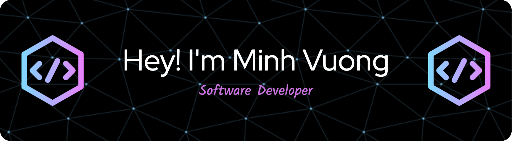

<!-- <h1 align="center">Hi 👋, I'm Minh Vuong</h1> -->
<h3 align="center">A passionate fullstack developer from Melbourne, Australia</h3>

&nbsp;

- 🔭 I’m currently working on **an iOS App**

- 👨‍💻 All of my projects are available at [minhvuong.surge.sh](minhvuong.surge.sh)

- 💬 Ask me about **Javascript or Python**

- 📫 How to reach me **mhvuong7@gmail.com**

- ⚡ Fun fact **I started coding at 15**

&nbsp;

<h3 align="left">Connect with me:</h3>

<h3 align="left">Languages and Tools:</h3>

                                 

&nbsp;

  

